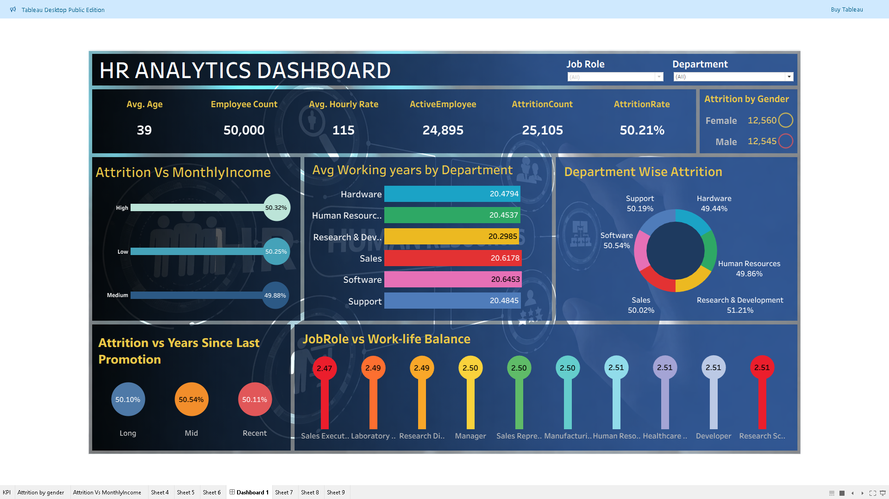

# HR-Analytics-Dashboard

## Project Overview
Developed an interactive HR Analytics Dashboard in Tableau using SQL to analyze 50K+ employee records and uncover insights related to employee attrition, work-life balance, promotions, income trends, and departmental performance.

## Tools Used
- Tableau
- SQL

## Key KPIs
- Average Attrition Rate across departments
- Attrition Rate vs Monthly Income
- Average Working Years by Department
- Job Role vs Work-Life Balance
- Attrition by Gender
- Attrition vs Years Since Last Promotion

## Business Insights
- The organization is experiencing a high attrition rate, increasing recruitment and training costs.
- Research & Development department recorded the highest attrition rate.
- Lower income groups showed relatively higher employee turnover.
- Employees with longer gaps since promotion demonstrated higher attrition trends.
- Attrition patterns were nearly equal across genders, indicating organization-wide retention challenges.

## Dashboard Preview

## Conclusion
This dashboard helps HR teams identify workforce trends, improve employee retention strategies, and support data-driven decision-making.
