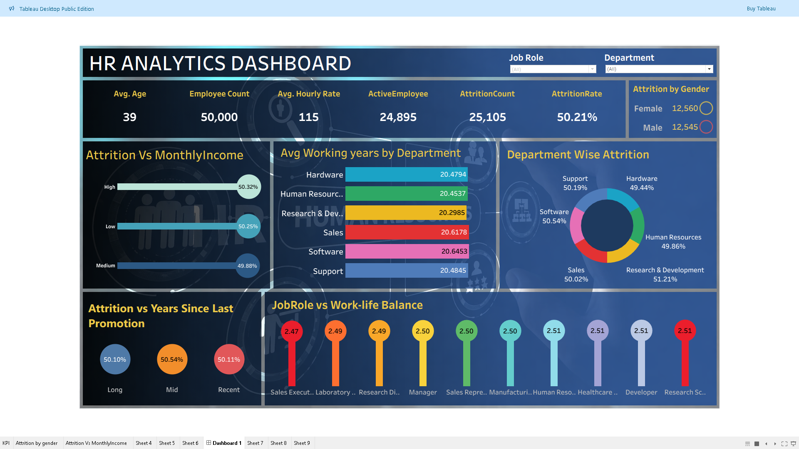

# HR-Analytics-Dashboard

## 📌 Project Overview

Developed an interactive HR Analytics Dashboard in Tableau using SQL to analyze 50K+ employee records and uncover insights related to employee attrition, work-life balance, promotions, income trends, and departmental performance.

---

## 🎯 Business Problem

Organizations need to understand employee attrition and identify workforce patterns that may affect employee retention.

This project analyzes employee data to answer questions such as:

- Which departments have higher attrition?
- How does attrition vary across income groups?
- Does work-life balance differ across job roles?
- How does attrition vary by gender?
- Is there a relationship between promotion gaps and attrition?
- Which departments have higher average working years?

---

## 🎯 Project Objectives

- Analyze overall employee attrition
- Compare attrition across departments
- Analyze attrition by monthly income
- Analyze attrition by gender
- Examine work-life balance across job roles
- Analyze attrition based on years since last promotion
- Compare average working years across departments
- Create an interactive dashboard for HR analysis

---

## 📊 Dataset

The dataset contains 50,000+ employee records with information related to:

- Age
- Gender
- Department
- Job Role
- Monthly Income
- Work-Life Balance
- Attrition Status
- Years Since Last Promotion
- Working Years
- Hourly Rate

The dataset was used for SQL analysis and Tableau dashboard development.

---

## 🧹 Data Preparation

The data was prepared before analysis by:

- Cleaning employee records
- Checking data types and missing values
- Standardizing categorical values
- Creating calculated fields required for analysis
- Preparing data for SQL analysis and Tableau visualization

---

## 🛠️ Tools & Technologies

- **SQL** – Data analysis and querying
- **Tableau** – Interactive dashboard development
- **Excel/CSV** – Data source
- **GitHub** – Project documentation and version control

---

## 🔍 SQL Analysis

SQL was used to analyze employee data and calculate important workforce metrics.

Analysis included:

- Aggregations
- `GROUP BY`
- `HAVING`
- Filtering
- Conditional calculations
- Department-level analysis
- Attrition analysis
- Income-based analysis
- Employee segmentation

---

## 📈 Key KPIs

- Average Attrition Rate across departments
- Attrition Rate vs Monthly Income
- Average Working Years by Department
- Job Role vs Work-Life Balance
- Attrition by Gender
- Attrition vs Years Since Last Promotion

---

## 💡 Business Insights

- The organization is experiencing a high attrition rate, increasing recruitment and training costs.
- Research & Development department recorded the highest attrition rate.
- Lower income groups showed relatively higher employee turnover.
- Employees with longer gaps since promotion demonstrated higher attrition trends.
- Attrition patterns were nearly equal across genders, indicating organization-wide retention challenges.

---

## 📊 Dashboard Preview

---

## 🏁 Conclusion

This dashboard helps HR teams identify workforce trends, improve employee retention strategies, and support data-driven decision-making.
